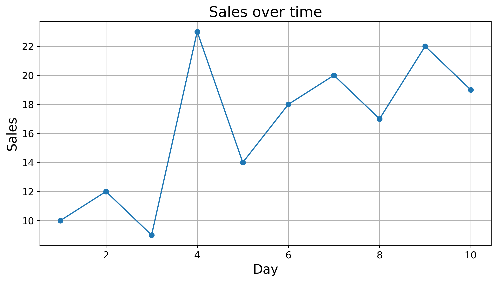
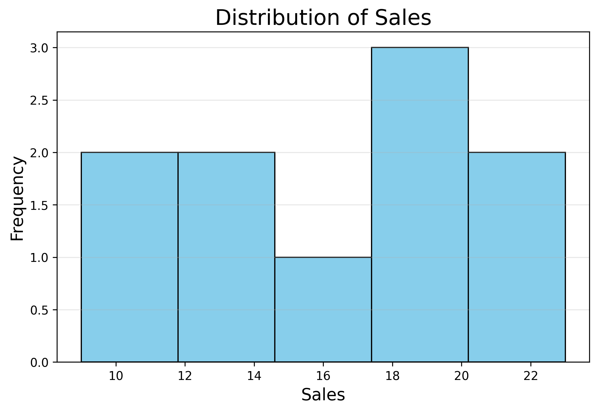
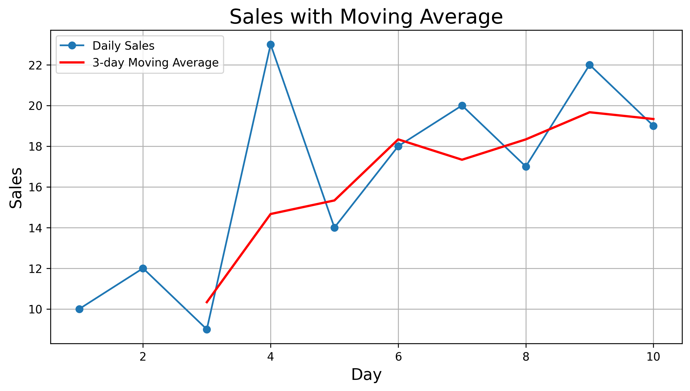
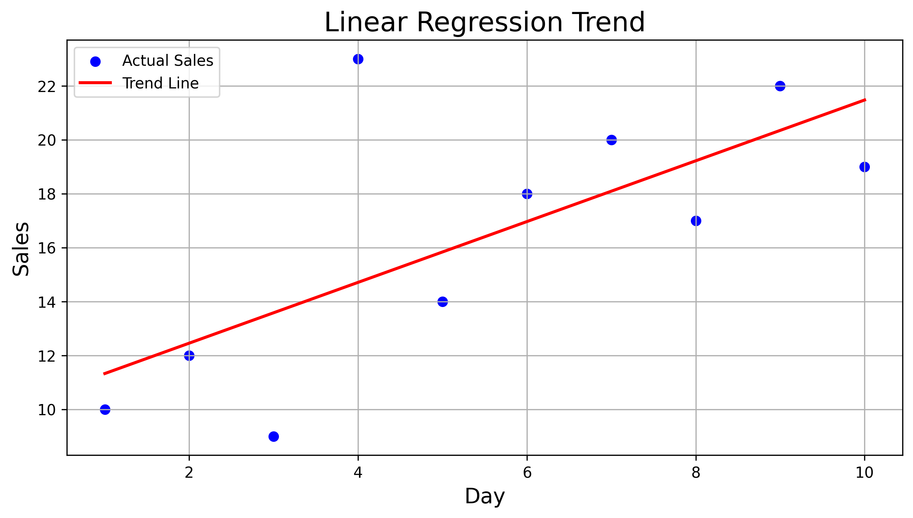

# Mini EDA Project - Sales Data Analysis

This project demonstrates a simple but complete exploratory data analysis (EDA) workflow using Python, Pandas, Matplotlib, and Jupyter Notebook.

The goal is to analyze daily sales data, calculate descriptive statistics, visualize trends, and structure the project.

## Project Structure
    mini_eda_project/ 
    1. data/sales_data.csv
    2. images/sales_plot.png
              sales_histogram.png
    3. notebooks/analysis.ipynb 
                 final_analysis.ipynb 
    4. src/analysis.py 
    5. README.md
    6. requirements.txt

## Contents
- **Data loading and inspection**
- **Descriptive statistics (mean, median, std, quartiles)**
- **Trend visualization (line plot)**
- **Structured mini‑EDA report**
- **Clean project folder organization**

## Example Visualization

## Sales Distribution Histogram

## Moving Average

## Linear regression

## Author
Oksana Polishchuk  
